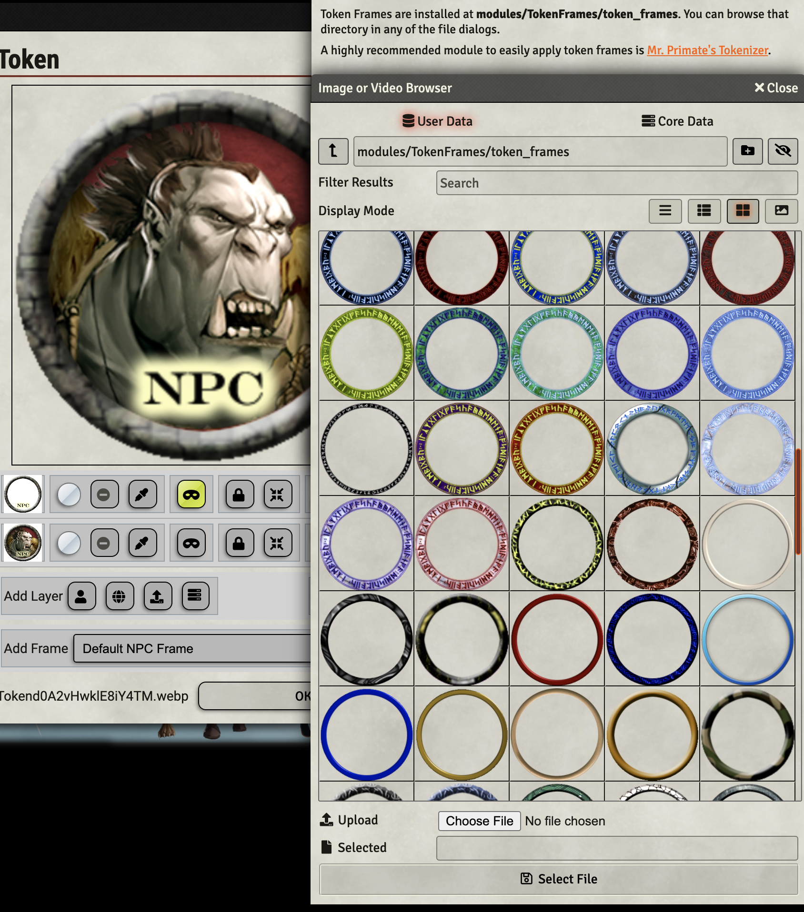

# VTT Token Frames

Most of these token frames were harvested from other opensource projects.

## Install on FoundryVTT v9 or higher

- Go to the **Setup** area of Foundry VTT.
- Click on the **Add-on Modules** tab.
- Click on the **Install Module** button.
- Paste this url `https://github.com/jcolson/token_frames/releases/latest/download/module.json` in the **Manifest URL** field.
- Click on the **Install Module** button.

The new token frames will be available at: `modules/token-frames/token_frames`.

A great tool to use in conjunction with this module is [Mr Primate's Tokenizer](https://github.com/mrprimate/vtta-tokenizer/).

### Sourced from TokenTool

[TokenTool](https://github.com/RPTools/TokenTool), which uses the ["GNU AFFERO GENERAL PUBLIC LICENSE"](https://github.com/RPTools/TokenTool/blob/main/LICENSE.md).

### Sourced from MTVExtreme

[MTVExtreme](https://www.deviantart.com/mtvextreme) on DeviantArt made a few really cool token frames based on the seasons.

### Sourced from Jinker

[Jinker#8073](https://discord.com) on Discord made a really cool 'web' themed token.

### Sourced from /u/Benjosity

[Benjosity](https://reddit.com/u/Benjosity) on Reddit made some really nice backgrounds and tokens, included them with their permission!

### Sourced from Pngwing

[Pngwing](https://www.pngwing.com/en/) has many high quality images that can be used for tokens, and can be used for non-commercial use!

### Sourced from pdzoch

[pdzoch](https://imgur.com/user/pdzoch) created many CR level coordinated token frames for baddies that have now been included.

### Sourced from Drehatlas#9068

[Drehatlas#9068](https://discord.com) Created some token frames themself as they are working on an adventure module for TDE.  "In case someone else likes the frames, then the effort wasn't for nothing!"

### Sourced from EldritchImp#1049

[EldritchImp#1049](https://discord.com) contributed some beautifully crafted class-based token frames!

More of \[their\] content; check out the following social media links:

- [Twitter](https://twitter.com/Eldritch_Imp)
- [Facebook](https://www.facebook.com/ImpmanArt)
- [Instagram](https://www.instagram.com/eldritchimp/)
- [Portfolio](https://t.co/vHnsPxhq7A)

## Feel free to send pull requests for additional token frame content

## Other modules

[foundryvtt_cards](https://github.com/jcolson/foundryvtt_cards) is a module that adds three new Foundry V9 card decks for import from a compendium.
